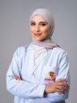

# Rahaf Adnan Al-Zeer

**B.Pharm · Graduate Teaching Assistant · MSc Candidate in Drug Discovery & Development**

📍 Ajman, UAE

Hi! I'm Rahaf — a pharmacist, researcher, and educator based in Ajman, UAE 🌸

I'm currently finishing my Master's in Drug Discovery & Development at Gulf Medical University, where I'm also a full-time Graduate Teaching Assistant. My thesis focuses on repurposing **Aprocitentan** — a licensed endothelin receptor antagonist — as a potential anticancer agent in pancreatic and breast cancer models. Defence is coming up in July 2026, Inshallah, and I can honestly say this journey has taught me as much about resilience as it has about science 😅

It was never just about the results. It was about learning how to keep going on the days when nothing seems to work — the failed trials, the repeated experiments, the unexpected readings — and then those small moments where everything finally starts to make sense 🤩 Alhamdulillah for every single one of them.

My research interests sit at the intersection of **molecular pharmacology**, **drug repurposing**, and **nanomedicine**. I am also a proud member of the **American Association for Cancer Research (AACR)** — a small step, but a meaningful one in my journey in cancer research, and I'm deeply looking forward to being part of that scientific community 🔬

Outside the lab, I lead the **Student Mentorship Programme** at Gulf Medical University's Student Happiness Centre, pairing students with academic and professional mentors. Watching students grow and find their path is one of the most rewarding parts of this role, honestly.

I have co-authored **6 publications** (2 as first author), spanning nanomedicine, qualitative pharmacist research, Alzheimer's therapeutics, and cancer pharmacology.

I hope you enjoy browsing my work — and if you see a chance to collaborate, I'd love to hear from you 💌

**Currently working on:**
Finishing my thesis 🏃‍♀️ · Preparing for my defence · Expanding into translational cancer research · Seeking PhD opportunities at the interface of molecular pharmacology, targeted delivery, and cancer biology

**Education**

🎓 MSc Drug Discovery & Development — Gulf Medical University, Ajman (2024 – July 2026 expected) · CGPA 3.9 / 4.0

🎓 Bachelor of Pharmacy (B.Pharm) — Dubai Medical University, Dubai (2020 – 2024) · CGPA 3.71 / 4.0

**Selected Publications**

📄 *Oral Delivery of Quercetin via Pro-Bilosomes as a Nano-Vesicle for Enhancing Bioavailability* — Submitted

📄 *Awareness and Views towards Aesthetic Treatment among the Public in the UAE* — Al-Zeer RA (First Author) — Submitted

📄 *Pharmacist Views and Barriers towards Promoting Disposal of Unwanted Medications in the UAE* — Published · BMC Public Health · DOI: 10.1186/s12889-025-21332-3

📄 *Lecanemab and Emerging Therapies for Alzheimer's Disease: A Narrative Review* — Published · International Journal of Alzheimer's Disease · DOI: 10.1155/2024/2052142

→ Full list on [Google Scholar](https://scholar.google.com/citations?user=uy-28F0AAAAJ&hl=en)

**Awards**

🥇 1st Place — Oral Presentation (Public Health & Biomedical Sciences) · 4th Al Ain University Postgraduate Symposium, Abu Dhabi · Feb 2026

🥈 2nd Place — Best Poster Presentation · 9th International Conference of Pharmacy and Medicine (ICPM 2024), Dubai · Feb 2024

**Technical Skills**

`Cell Culture` `MTT Assay` `SRB Cytotoxicity` `Western Blotting` `qPCR` `ELISA` `RNA Extraction`
`Nano-vesicle Formulation` `Zeta-Sizer` `LC-MS` `Immunohistochemistry` `Metabolomics`
`SPSS` `DD Solver` `PK Solver` `Thematic Analysis` `Manuscript Writing`

*Part of the [ScholarlyBrightMinds](https://github.com/ScholarlyBrightMinds) academic network*

